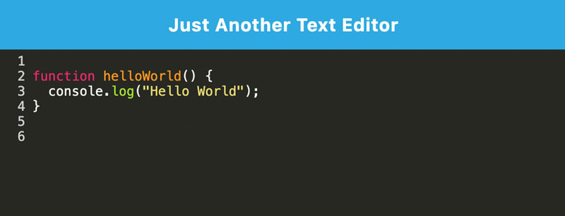

# Progressive Web Application (PWA): Just Another Text Editor

Just Another Text Editor (J.A.T.E) is a single-page web app that enables users to write and store JavaScript code with syntax highlighting, with or without an internet connection. It can be used in a browser or installed as a PWA. If code is entered while offline, when a connection is restored the app saves the current code snippets in the app.

This app uses webpack to build the lightweight PWA, along with a manifest and service workers to handle the PWA requirements and caching, and data storage in the IndexedDB database.

